# Entity Relationship Diagram (ERD)
## FSUU Management System Database Schema

```mermaid
erDiagram
    USERS {
        bigint id PK
        string name
        string email UK
        string password
        enum role "admin, faculty, student"
        timestamp email_verified_at
        timestamp created_at
        timestamp updated_at
    }

    DEPARTMENTS {
        bigint id PK
        string name
        string code
        string description
        string dean
        integer students_count
        integer faculty_count
        timestamp created_at
        timestamp updated_at
        timestamp deleted_at "Soft Delete"
    }

    COURSES {
        bigint id PK
        string name
        string description
        string status "Open/Closed"
        integer enrolled_count
        bigint department_id FK
        timestamp created_at
        timestamp updated_at
        timestamp deleted_at "Soft Delete"
    }

    STUDENTS {
        bigint id PK
        string first_name
        string last_name
        string middle_name
        integer age
        enum gender "Male, Female"
        string email
        string profile_image
        date date_of_birth
        string place_of_birth
        enum blood_type
        string height
        enum civil_status
        text house_street_barangay
        string region
        string province
        string municipality
        string religion
        string citizenship
        string contact_number_phone
        string mobile_number
        string language_spoken
        string elementary_school_name
        string elementary_school_address
        string elementary_year_graduated
        string elementary_school_type
        string junior_high_school_name
        string junior_high_school_address
        string junior_high_year_graduated
        string junior_high_school_type
        string senior_high_school_name
        string senior_high_school_address
        string senior_high_year_graduated
        string senior_high_school_type
        string college_school_name
        string college_school_address
        string college_year_graduated
        string college_school_type
        string mother_family_name
        string mother_given_name
        string mother_middle_name
        string mother_occupation
        string mother_home_address
        string mother_town_city
        string mother_province
        string mother_contact_number
        string mother_mobile_number
        string father_family_name
        string father_given_name
        string father_middle_name
        string father_occupation
        string father_home_address
        string father_town_city
        string father_province
        string father_contact_number
        string father_mobile_number
        integer number_of_brothers
        integer number_of_sisters
        string guardian_family_name
        string guardian_given_name
        string guardian_middle_name
        string guardian_relationship
        string guardian_home_address
        string guardian_contact_number
        string guardian_mobile_number
        string emergency_contact_name
        string emergency_contact_number
        string study_sponsor
        string monthly_income
        string insurance_beneficiary_family_name
        string insurance_beneficiary_given_name
        string insurance_beneficiary_middle_name
        date insurance_beneficiary_date_of_birth
        string intended_degree_program
        boolean is_working_student
        string employer_name
        string employer_address
        text previous_schools_attended
        boolean applied_to_fsuu_before
        string fsuu_application_year
        boolean fsuu_was_accepted
        boolean fsuu_did_attend
        string fsuu_year_attended
        boolean is_indigenous_peoples_member
        string indigenous_tribe
        boolean has_disability
        string disability_specification
        boolean is_single_parent_dependent
        boolean has_special_needs
        string special_needs_specification
        bigint department_id FK
        bigint course_id FK
        timestamp created_at
        timestamp updated_at
        timestamp deleted_at "Soft Delete"
    }

    FACULTY {
        bigint id PK
        string first_name
        string last_name
        integer age
        enum gender "Male, Female"
        string email
        string profile_image
        date date_of_birth
        bigint department_id FK
        timestamp created_at
        timestamp updated_at
        timestamp deleted_at "Soft Delete"
    }

    %% Relationships
    DEPARTMENTS ||--o{ COURSES : "has many"
    DEPARTMENTS ||--o{ STUDENTS : "has many"
    DEPARTMENTS ||--o{ FACULTY : "has many"
    COURSES ||--o{ STUDENTS : "has many"
    
    %% Logical Relationships (via email)
    USERS ||--o| STUDENTS : "linked by email"
    USERS ||--o| FACULTY : "linked by email"
```

## Entity Descriptions

### USERS
- **Purpose**: Authentication and authorization for all system users
- **Key Fields**:
  - `id`: Primary key
  - `email`: Unique identifier, used to link with Students and Faculty
  - `role`: Determines access level (admin, faculty, student)
  - `password`: Hashed password for authentication
- **Relationships**: 
  - Linked to Students via email (logical relationship)
  - Linked to Faculty via email (logical relationship)

### DEPARTMENTS
- **Purpose**: Academic departments within the university
- **Key Fields**:
  - `id`: Primary key
  - `name`: Department name
  - `code`: Department code (e.g., "CIT", "ASP")
  - `description`: Department description
  - `dean`: Name of the department dean
  - `students_count`: Count of students in department
  - `faculty_count`: Count of faculty in department
- **Relationships**:
  - One-to-Many with Courses
  - One-to-Many with Students
  - One-to-Many with Faculty
- **Soft Delete**: Yes (archived records retained)

### COURSES
- **Purpose**: Academic courses/programs offered by departments
- **Key Fields**:
  - `id`: Primary key
  - `name`: Course name (e.g., "BSIT", "BSN")
  - `description`: Full course description
  - `status`: Open or Closed for enrollment
  - `enrolled_count`: Number of enrolled students
  - `department_id`: Foreign key to Departments
- **Relationships**:
  - Many-to-One with Departments
  - One-to-Many with Students
- **Soft Delete**: Yes (archived records retained)

### STUDENTS
- **Purpose**: Comprehensive student information and profiles
- **Key Fields**:
  - `id`: Primary key
  - `first_name`, `last_name`, `middle_name`: Student name
  - `email`: Used to link with Users table
  - `age`, `date_of_birth`: Age information
  - `gender`: Male or Female
  - `department_id`: Foreign key to Departments
  - `course_id`: Foreign key to Courses
  - Extensive profile fields: address, family info, educational background, etc.
- **Relationships**:
  - Many-to-One with Departments
  - Many-to-One with Courses
  - Linked to Users via email (logical relationship)
- **Soft Delete**: Yes (archived records retained)

### FACULTY
- **Purpose**: Faculty member information
- **Key Fields**:
  - `id`: Primary key
  - `first_name`, `last_name`: Faculty name
  - `email`: Used to link with Users table
  - `age`, `date_of_birth`: Age information
  - `gender`: Male or Female
  - `department_id`: Foreign key to Departments
- **Relationships**:
  - Many-to-One with Departments
  - Linked to Users via email (logical relationship)
- **Soft Delete**: Yes (archived records retained)

## Relationship Details

1. **DEPARTMENTS → COURSES** (One-to-Many)
   - A department can have multiple courses
   - A course belongs to one department
   - Foreign Key: `courses.department_id` → `departments.id`
   - Cascade: `nullOnDelete` (course can exist without department)

2. **DEPARTMENTS → STUDENTS** (One-to-Many)
   - A department can have multiple students
   - A student belongs to one department
   - Foreign Key: `students.department_id` → `departments.id`
   - Cascade: `nullOnDelete` (student can exist without department)

3. **DEPARTMENTS → FACULTY** (One-to-Many)
   - A department can have multiple faculty members
   - A faculty member belongs to one department
   - Foreign Key: `faculty.department_id` → `departments.id`
   - Cascade: `nullOnDelete` (faculty can exist without department)

4. **COURSES → STUDENTS** (One-to-Many)
   - A course can have multiple students
   - A student belongs to one course
   - Foreign Key: `students.course_id` → `courses.id`
   - Cascade: `nullOnDelete` (student can exist without course)

5. **USERS → STUDENTS** (One-to-One, Logical)
   - Linked via email address
   - Each user with role 'student' should have a corresponding student record
   - No foreign key constraint (maintained in application logic)

6. **USERS → FACULTY** (One-to-One, Logical)
   - Linked via email address
   - Each user with role 'faculty' should have a corresponding faculty record
   - No foreign key constraint (maintained in application logic)

## Soft Delete Implementation

All main entities (Departments, Courses, Students, Faculty) implement soft deletes:
- Records are not permanently deleted
- `deleted_at` timestamp marks archived records
- Archived records are automatically deleted after 1 year via scheduled task
- Archive page allows restoration of soft-deleted records

## Notes

- The system uses email as a logical link between Users and Students/Faculty rather than foreign keys
- All foreign key relationships use `nullOnDelete` to allow records to exist independently
- The system supports role-based access control through the Users.role field
- Comprehensive student profiles include extensive personal, educational, and family information

